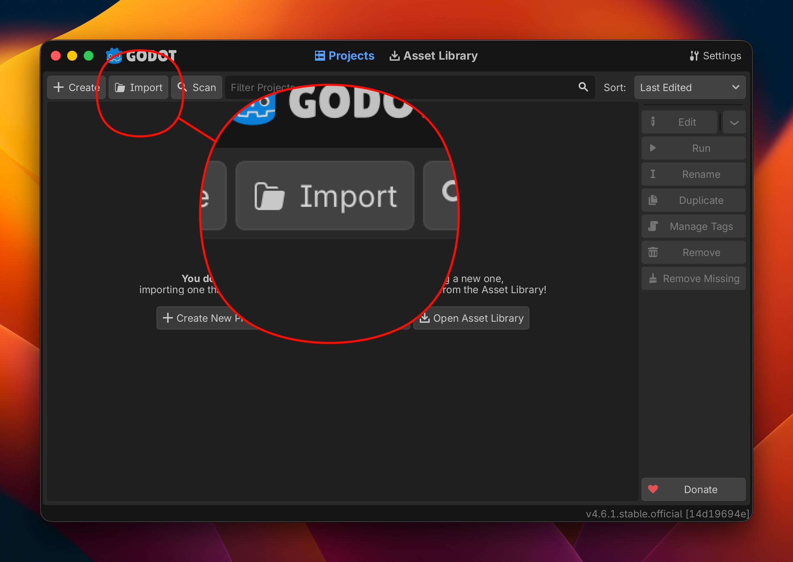
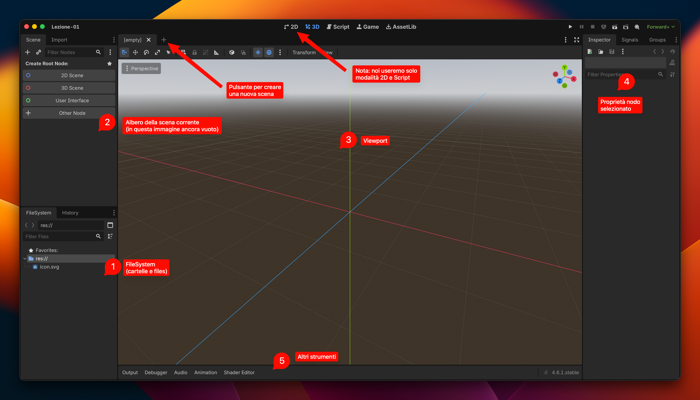

# Lezione 01 – Installiamo Godot e apriamo il progetto

Prima di iniziare a fare il gioco, dobbiamo installare il programma e aprire il progetto base da cui partiremo.

---

## 1. Scarica Godot

Vai su **[godotengine.org](https://godotengine.org/)** e clicca su **Download**.

Scarica **Godot Engine 4** — la versione normale, non quella ".NET".

> [!NOTE]
> Godot non richiede installazione: è un singolo file che si apre e basta. Puoi anche tenerlo sul desktop o su una chiavetta USB.

---

## 2. Scarica i file del corso

Vai su **[github.com/niccolofavari/GodotCorso2026](https://github.com/niccolofavari/GodotCorso2026)**, clicca sul bottone verde **Code** e poi **Download ZIP**.

Decomprimi lo ZIP e tieni la cartella in un posto che ricordi facilmente (es. il Desktop).

---

## 3. Apri il progetto in Godot

1. Avvia Godot — si aprirà il **Project Manager** (la schermata iniziale con la lista dei progetti)
2. Clicca su **Import**
3. Naviga fino alla cartella `lezione-00`
4. Seleziona il file `project.godot`
5. Clicca **Import & Edit**

Il progetto si apre e vedrai l'editor di Godot.

---

## 4. Orientati nell'interfaccia

L'editor di Godot è diviso in alcune aree principali:

| # | Area | Dove si trova | A cosa serve |
|---|---|---|---|
| 1 | **FileSystem** | In basso a sinistra | Tutti i file del progetto (immagini, suoni, script...) |
| 2 | **Scene** | In alto a sinistra | L'albero dei nodi della scena aperta |
| 3 | **Viewport** | Al centro | Quello che vedi nel gioco |
| 4 | **Inspector** | A destra | Le proprietà del nodo selezionato |
| 5 | **Output** | In basso | Messaggi ed errori mentre il gioco gira |

Non preoccuparti di capire tutto adesso — lo scopriremo insieme durante le lezioni.

---

## 5. Cosa c'è già nel progetto

Abbiamo già preparato alcune cose per te, così non perdiamo tempo in classe a configurare i dettagli tecnici:

- ✅ La **risoluzione** della finestra è già quella giusta per il nostro gioco in pixel art
- ✅ Le **immagini**, i **font** e i **suoni** sono già importati nella cartella `assets/`
- ✅ I **layer di collisione** sono già nominati

> [!TIP]
> Vuoi capire cosa significa ognuna di queste cose? Le spieghiamo qui:
> - → [Cos'è la risoluzione e il viewport?](../appendice/risoluzione.md)
> - → [Cosa sono i layer di collisione?](../appendice/layer-di-collisione.md)
> - → [Cosa sono gli asset?](../appendice/asset.md)

---

## 6. Premi Play ▶

Premi il bottone **▶** in alto al centro (o `F5`) per avviare il gioco.

Si aprirà una finestra grigia — è normale, non abbiamo ancora aggiunto nulla! Chiudila pure.

<!-- SCREENSHOT: finestra di gioco vuota/grigia che appare dopo aver premuto Play -->

---

## Gli asset inclusi

Nella cartella `assets/` trovi tutto il materiale grafico e sonoro che useremo durante il corso:

| Cartella | Contenuto |
|---|---|
| `sprites/` | Le immagini per il personaggio, i nemici, le monete, il livello |
| `fonts/` | Font in stile pixel art |
| `sounds/` | Effetti sonori (salto, moneta, esplosione...) |
| `music/` | Musica di sottofondo |
